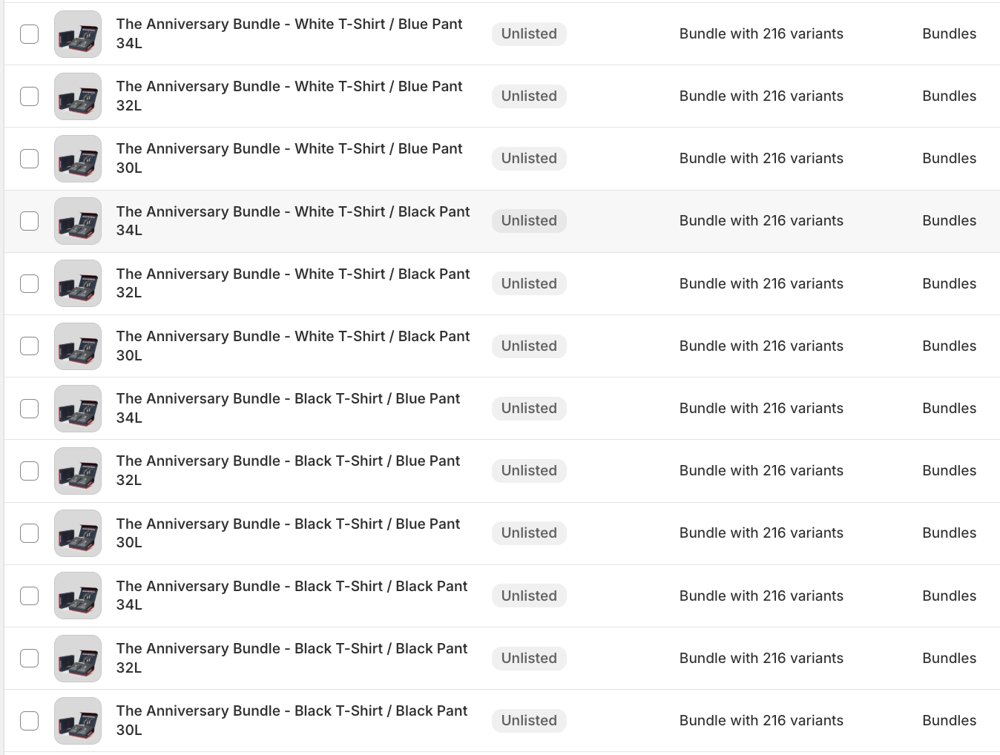
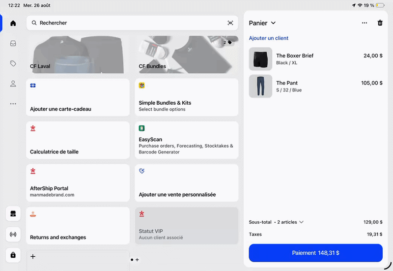

# Bundles

## Context 

Historically, our online bundles have been their own products with individual SKUs per bundle. 
The bundle components did not break down in Shopify - rather, we would map the bundle SKU further along in our fulfillment flow: in Shipstation, Finale, AfterShip Returns.

**The reason for this (and for all of our current workarounds) is because Shopify Bundles’ 3 product option limit restricts the number of product combinations that we can offer.** 

## What we’re moving towards 

We are currently experimenting with leveraging native Shopify Bundles to build out our bundles to avoid creating new SKUs, which creates additional labour and complications downstream. However, we are still experiencing friction with Shopify’s product option limit. 

For example, the Anniversary Bundle contains 2,592 variants and 6 product options, which means we’ve had to create 12 different bundles to get around the limits:

{ align=left }

We’re leveraging Shopify’s Section Rendering API to create a seamless experience for the user - however, from a product management standpoint, this is not ideal. That said, this switch has led to vast improvements in our fulfillment process, including returns. 

!!! warning
    One pain point: We are currently unable to pass line item attributes to bundled products, leading to fulfillment confusion when packing orders in Shipstation. Ideally, we could assign a Bundle ID to line items to allow the fulfillment team to identify which items are bundled together (in the case where a customer buys more than one bundle with a different configuration). 
    This could be accomplished by building a custom implementation that leverages the Shopify Cart Transform API to pass custom attributes to bundled products.

    Another pain point that was recently discovered by CX is that Shopify Bundles limits our ability to edit orders in the Shopify Admin.

### Current and Anticipated Pain Points

| Issue                | Old Bundle Method (Bundle SKUs)      | Shopify Bundles                     | Custom App Implementation |
| -------------------- | ------------------------------------ | ----------------------------------- | ------------------------- |
| SKU Management       | ❌ Bad - Creates additional labour and complications downstream. | ✅        | ✅     |
| Order Edits          |✅ |  ❌ Bad - Bundles cannot be easily edited in the Shopify Admin | TBD |
| Fulfillment          |   🟡 OK - Low component visibility for warehouse team     | 🟡 OK  - Packing slip does not show bundle components on line items, only in order notes.        | ✅  |
| Exchanges/Returns (Online) | 🟡 OK - Requires additional product mapping in AfterShip            | ✅          | ✅ 
| Exchanges/Returns (Online > POS)      | ❌ Bad - Retail staff must refund the entire order, re-purchase, and partially fulfill          | ✅         | ✅  |
| Inventory Management | ❌ Bad - Finance team needs to manually track OOS bundles          |  ✅          | ✅           |
| State Taxes          | ❌ Bad - State tax exemptions are not respected       |  ✅          | ✅  |
| Product Option Limit | ❌ Bad - 3 product options max             |  ❌ Bad - 3 product options max          | ✅  |
| Location Scope       | ✅        |  ✅    | ✅  |
| Shop App             | ✅          |  ✅          | ❌ Bad - No control over Shop app UI  |
| Finance              | TBD    |  TBD          | TBD  |

## POS

We are currently using the app Simple Bundles to create “Infinite Options” bundles to make it easier for retail staff to customize bundles, as having 12 of the same bundle in our product catalogue would make for an undesirable user experience. Simple Bundles uses the Cart Transform API to expand a parent product into its children. Although relying on a 3rd–party app is not ideal, it was a quick and easy solution to implement for the time being. Eventually we’d like to move away from this. 

### Bundling with Automatic Discount Functions (Power X - Functions) 

Another solution we’ve been exploring for POS is configuring discount functions with the help of Power X - Functions, which would allow retail staff to add individual bundle components to a customer’s cart - the cart would then automatically bundle items if it meets the criteria:

{ align=left }