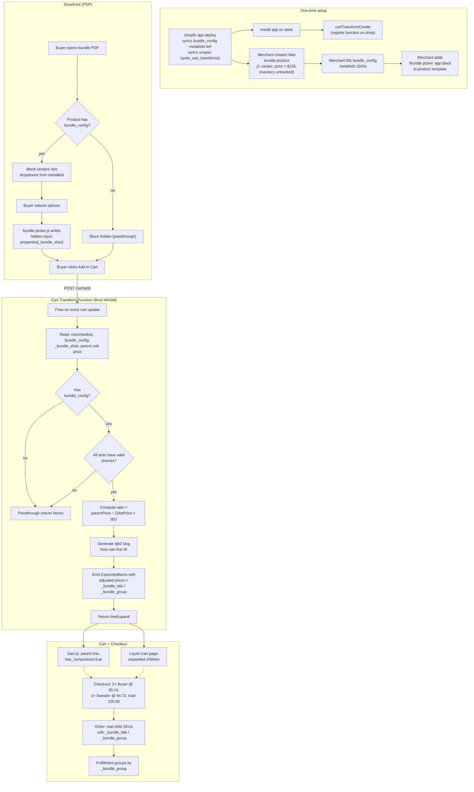

# Bundles

## Context 

Historically, our online bundles have been their own products with individual SKUs per bundle. 
The bundle components did not break down in Shopify - rather, we would map the bundle SKU further along in our fulfillment flow: in Shipstation, Finale, AfterShip Returns.

**The reason for this (and for all of our current workarounds) is because Shopify Bundles’ 3 product option limit restricts the number of product combinations that we can offer.** 

Another pain point with this method has to do with sales tax thresholds in the US - for example, items priced under $110 per item or pair are exempt from the New York State 4% sales tax. Because our old bundles are grouped under a single SKU, Shopify has no way to tell that it contains multiple clothing items, thus overcharging sales tax. 

## What we’re moving towards 

We are currently experimenting with leveraging native Shopify Bundles to build out our bundles to avoid creating new SKUs, which creates additional labour and complications downstream. However, we are still experiencing friction with Shopify’s product option limit. 

For example, the Anniversary Bundle contains 2,592 variants and 6 product options, which means we’ve had to create 12 different bundles to get around the limits:

{ align=left }

We’re leveraging Shopify’s Section Rendering API to create a seamless experience for the user - however, from a product management standpoint, this is not ideal. That said, this switch has led to vast improvements in our fulfillment process, including returns. 

!!! warning
    One pain point: We are currently unable to pass line item attributes to bundled products, leading to fulfillment confusion when packing orders in Shipstation. Ideally, we could assign a Bundle ID to line items to allow the fulfillment team to identify which items are bundled together (in the case where a customer buys more than one bundle with a different configuration). 
    This could be accomplished by building a custom implementation that leverages the Shopify Cart Transform API to pass custom attributes to bundled products.

    Another pain point that was recently discovered by CX is that Shopify Bundles limits our ability to edit orders in the Shopify Admin.

## POS

We are currently using the app Simple Bundles to create “Infinite Options” bundles to make it easier for retail staff to customize bundles, as having 12 of the same bundle in our product catalogue would make for an undesirable user experience. Simple Bundles uses the Cart Transform API to expand a parent product into its children. Although relying on a 3rd–party app is not ideal, it was a quick and easy solution to implement for the time being. Eventually we’d like to move away from this. 

### Bundling with Automatic Discount Functions (Power X - Functions) 

Another solution we’ve been exploring for POS is configuring discount functions with the help of Power X - Functions, which would allow retail staff to add individual bundle components to a customer’s cart - the cart would then automatically bundle items if it meets the criteria:

{ align=left }

## manmade-bundles — architecture

End-to-end reference for how the bundle app works and how bundles are configured.

### End-to-end flow



## `bundle_config` metafield structure

- **Owner**: Product
- **Namespace / key**: `$app` / `bundle_config`
- **Type**: `json`
- **Access**: `merchant_read_write`
- **Validated by**: JSON Schema in `shopify.app.toml`

Top-level shape:

```json
{
  "components": [ ... ],
  "slots":      [ ... ]
}
```

Either array can be empty or omitted, but at least one must have entries or the function will passthrough (no expansion).

### `components[]` — fixed, non-selectable items in every bundle

| Field | Type | Required | Used for |
|---|---|---|---|
| `variantId` | string, `gid://shopify/ProductVariant/<n>` | ✅ | The real child SKU to add to the cart when the bundle is expanded. |
| `quantity` | integer, 1–2000 | ✅ | How many of this variant per bundle instance. Multiplied by parent line quantity at expansion time. |
| `listPrice` | decimal string, e.g. `"35.00"` | ✅ | The child's "undiscounted" price. Used as the weight when distributing the parent bundle's price proportionally across children. Not shown to the buyer directly. |

Example: `{ "variantId": "gid://shopify/ProductVariant/…BoxerBlack", "quantity": 2, "listPrice": "35.00" }` means "every Cozy Bundle contains 2 Black Boxers, and for pricing math treat each boxer as worth $35."

### `slots[]` — buyer-selectable items

Each slot renders as one `<select>` in the theme block. Buyer picks one variant per slot.

| Field | Type | Required | Used for |
|---|---|---|---|
| `role` | string, `[a-z0-9_]+` | ✅ | Stable identifier for the slot. Appears in the `_bundle_slots` line item property as a JSON key. Must be unique within a product. Also used as the fallback dropdown label if `title` is empty. |
| `quantity` | integer, 1–2000 | ✅ | How many units of the chosen variant to add per bundle instance. |
| `title` | string | ⛔ | Human-readable label shown above the slot's dropdown on the PDP. Falls back to `role` if omitted. Buyer-facing. |
| `allowedVariants[]` | array (min 1 item) | ✅ | The valid choices for this slot. The theme block renders these as options; the function validates the buyer's pick against this list. |

#### `allowedVariants[]` — the choices per slot

| Field | Type | Required | Used for |
|---|---|---|---|
| `variantId` | string, `gid://shopify/ProductVariant/<n>` | ✅ | The real child SKU this option maps to. |
| `label` | string | ⛔ | Human-readable dropdown option label (e.g. `"Black"`). Falls back to the raw variant GID if omitted. Buyer-facing. |
| `listPrice` | decimal string | ✅ | Same purpose as `components[].listPrice` — pricing weight, not customer-facing. |

Example slot:

```json
{
  "role": "sweater",
  "quantity": 1,
  "title": "Choose your sweater",
  "allowedVariants": [
    { "variantId": "gid://shopify/ProductVariant/…SweaterBlack", "label": "Black", "listPrice": "110.00" },
    { "variantId": "gid://shopify/ProductVariant/…SweaterBlue",  "label": "Blue",  "listPrice": "110.00" }
  ]
}
```

### Full example — The Cozy Bundle

```json
{
  "components": [
    {
      "variantId": "gid://shopify/ProductVariant/…BoxerBlack",
      "quantity": 2,
      "listPrice": "35.00"
    }
  ],
  "slots": [
    {
      "role": "sweater",
      "quantity": 1,
      "title": "Choose your sweater",
      "allowedVariants": [
        { "variantId": "gid://shopify/ProductVariant/…SweaterBlack", "label": "Black", "listPrice": "110.00" },
        { "variantId": "gid://shopify/ProductVariant/…SweaterBlue",  "label": "Blue",  "listPrice": "110.00" }
      ]
    }
  ]
}
```

With the parent variant priced at **$155** in Shopify:

- Sum of list prices × qty = 2×$35 + 1×$110 = **$180**
- Ratio = $155 / $180 ≈ **0.86111**
- Boxer adjusted unit price = $35 × 0.86111 ≈ **$30.14**
- Sweater adjusted unit price (absorbs penny remainder) = $155 − 2×$30.14 = **$94.72**
- Children sum exactly to $155 in checkout.

### Injected line item properties on expanded children

| Property | Value | Purpose |
|---|---|---|
| `_bundle_title` | Parent product title (e.g. `"The Cozy Bundle"`) | Human-readable bundle name for fulfillment/packing slips. Read from `merchandise.product.title` at function runtime. |
| `_bundle_group` | `<djb2-hash-of-cart-line-id> (i/N)` (e.g. `"b95186f4 (1/2)"`) | Groups the child lines belonging to one bundle instance. `i/N` distinguishes multiple bundles on the same cart line (parent quantity > 1). Deterministic and pure — no RNG or clock. |

Underscore prefix hides these properties from checkout UI but keeps them on the order.

### Buyer choice transport — `_bundle_slots`

The theme block writes **one** hidden line item property on the parent cart line:

```
properties[_bundle_slots] = '{"sweater":"gid://shopify/ProductVariant/…"}'
```

- One-input design because `CartLine.attribute(key:)` in the function's input query only accepts one key at a time — we can't statically enumerate slot roles.
- Function parses the JSON, then for each `slots[]` entry looks up the chosen variant by `role` and validates it's in `allowedVariants`.
- Missing or invalid → the whole line passes through unchanged (no half-expansions).
